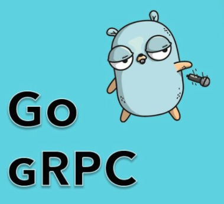

# Getting Started gRPC with Go


> Credit https://tutorialedge.net/golang/go-grpc-beginners-tutorial/

### What is gRPC?

>  gRPC is a modern, open source remote procedure call (RPC) framework that can run anywhere

Remote Procedure Calls are something that we use within distributed systems that allow us to communicate between applications. More specifically, it allows us to expose methods within our application that we want other applications to be able to invoke.

### Prerequisites
* Go plugins for the protocol compiler:

* Install the protocol compiler plugins for Go using the following commands:
```bash
$ export GO111MODULE=on  # Enable module mode
$ go get google.golang.org/protobuf/cmd/protoc-gen-go \
         google.golang.org/grpc/cmd/protoc-gen-go-grpc
```

* Update your PATH so that the protoc compiler can find the plugins:
```bash
$ export PATH="$PATH:$(go env GOPATH)/bin"
```
### Usage
First, you need to split the screen with to parts

In the first part of the screen you need to start server with the command:
```bash
$ go run server.go
```
and you'll see the following message:
```bash
gRPC server listening on port 9000
```
After that, you need to start a client to send a request to the gRPC server at the second part of the screen:
```bash
$ go run client.go
```
As soon as you type a command above, you will the see following messages in both screen:
```bash
# On the server side
$ Receive message body from client: Hello From Client !

# On the client side
$  Response from server: Hello From the Server!       
```
### With 3rd party client called `grpcurl`

On macOS, grpcurl is available via Homebrew:
```bash
$ brew install grpcurl
```

First, you should start the gRPC server like above:
```bash
$ go run server.go 
```

Then, you can get the service list exposed by the service with the command below:
```bash
$ grpcurl -plaintext localhost:9000 list
$ grpcurl -plaintext localhost:9000 list chat.ChatsService
$ grpcurl -plaintext localhost:9000 describe chat.ChatsService.SayHello
```

Invoking gRPC method expose by the service:
```bash
$ grpcurl -d '{"body": "hello from iTerm2"}' -plaintext localhost:9000 chat.ChatsService/SayHello
```
