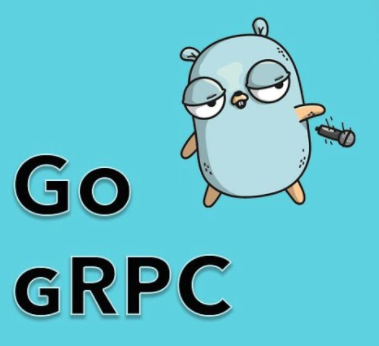

# Getting Started gRPC with Go


> Credit https://tutorialedge.net/golang/go-grpc-beginners-tutorial/

### What is gRPC?

>  gRPC is a modern, open source remote procedure call (RPC) framework that can run anywhere

Remote Procedure Calls are something that we use within distributed systems that allow us to communicate between applications. More specifically, it allows us to expose methods within our application that we want other applications to be able to invoke.

### Prerequisites
Protocol buffer compiler, protoc, version 3.

For installation instructions, see Protocol Buffer Compiler Installation.

Go plugins for the protocol compiler:

Install the protocol compiler plugins for Go using the following commands:
```bash
$ export GO111MODULE=on  # Enable module mode
$ go get google.golang.org/protobuf/cmd/protoc-gen-go \
         google.golang.org/grpc/cmd/protoc-gen-go-grpc
```

Update your PATH so that the protoc compiler can find the plugins:
```bash
$ export PATH="$PATH:$(go env GOPATH)/bin"
```
